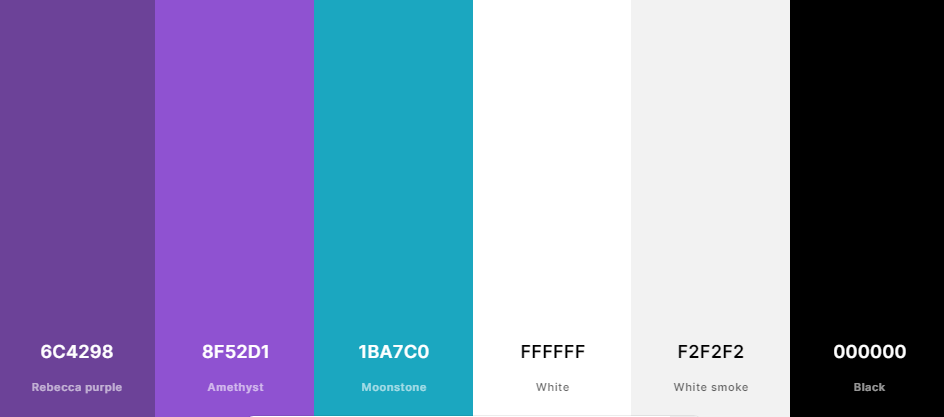

# QUIZZICAL

Quizzical is an interactive quiz website that provides users with a quiz round on random topics.
Each round consists of 10 questions, and provides instant feedback on whether the answers are correct in the form of text and color codes. The correct answer score is tallied on the quiz page, allowing users to keep track of each round. 
 
You can view the deployed site here:
(https://dmp-86.github.io/quizzical)

## UX

### Colour Scheme

- `#000000` used for dark.
- `#ffffff` used for light.
- `#f2f2f2` used for grey.
- `#8f52d1` used for light purp. 
- `#6c4298` used for dark purp. 
- `#b1fdb1` used for light blue. 
- `#4c55cc99` used to highlight some text areas 

I used [coolors.co](https://coolors.co/6c4298-8f52d1-1ba7c0-ffffff-f2f2f2-000000) to generate my colour palette.

### Typography

- [Fira Sans Extra Condensed](https://fonts.google.com/specimen/Fira+Sans+Extra+Condensed?query=fira) was used for the primary header.

- [Poppins](https://fonts.google.com/specimen/Poppins) was used for all other content text.

- [Font Awesome](https://fontawesome.com) icons were used throughout the site, such as the social media icons in the footer and icongraphy within headings. *need to add decent footer 

## Features

### Features
- **Features on all pages**
- Favicon appears on the browser tab across all pages (images/quizfavicon.png)
- Title links back to index page (images/titlelink.png)

- **Home Page**

-  

- **The Hero Image & Hero Cover**

-  

### Future Features

With additional time to spend on this project, I believe the below features would improve the overall user experience. 

- Truncated text/read more
    - Reduce blocks of text to improve readability of the page and improve the structure. 
- Eligibility Checker 
    - Introduce a survey for users to allow them to check their own eligibility, based on official criteria. 
- Cost Simulator
    - Introduce a calculator into the site where users can simulate how much a monthly prescription will cost them, based on their individual needs. 

## Tools & Technologies Used

- [HTML](https://en.wikipedia.org/wiki/HTML) used for the main site content.
- [CSS](https://en.wikipedia.org/wiki/CSS) used for the main site design and layout.
- [CSS Flexbox](https://www.w3schools.com/css/css3_flexbox.asp) used for an enhanced responsive layout.
- [Git](https://git-scm.com) used for version control. (`git add`, `git commit`, `git push`)
- [GitHub](https://github.com) used for secure online code storage.
- [GitHub Pages](https://pages.github.com) used for hosting the deployed front-end site.
- [Gitpod](https://gitpod.io) used as a cloud-based IDE for development.
- [Markdown Builder by Tim Nelson](https://traveltimn.github.io/readme-builder) used to help generate the Markdown files.

## Testing

For all testing, please refer to the [TESTING.md](TESTING.md) file.

## Deployment

The site was deployed to GitHub Pages. The steps to deploy are as follows:
- In the [GitHub repository](https://dmp-86.github.io/quizzical/), navigate to the Settings tab 
- From the source section drop-down menu, select the **Main** Branch, then click "Save".
- The page will be automatically refreshed with a detailed ribbon display to indicate the successful deployment.

The live link can be found [here](https://dmp-86.github.io/quizzical)

### Local Deployment

This project can be cloned or forked in order to make a local copy on your own system.

#### Cloning

You can clone the repository by following these steps:

1. Go to the [GitHub repository](https://dmp-86.github.io/quizzical) 
2. Locate the Code button above the list of files and click it 
3. Select if you prefer to clone using HTTPS, SSH, or GitHub CLI and click the copy button to copy the URL to your clipboard
4. Open Git Bash or Terminal
5. Change the current working directory to the one where you want the cloned directory
6. In your IDE Terminal, type the following command to clone my repository:
	- `git clone https://dmp-86.github.io/quizzical.git`
7. Press Enter to create your local clone.

Alternatively, if using Gitpod, you can click below to create your own workspace using this repository.

Please note that in order to directly open the project in Gitpod, you need to have the browser extension installed.
A tutorial on how to do that can be found [here](https://www.gitpod.io/docs/configure/user-settings/browser-extension).

#### Forking

By forking the GitHub Repository, we make a copy of the original repository on our GitHub account to view and/or make changes without affecting the original owner's repository.
You can fork this repository by using the following steps:

1. Log in to GitHub and locate the [GitHub Repository](https://dmp-86.github.io/quizzical)
2. At the top of the Repository (not top of page) just above the "Settings" Button on the menu, locate the "Fork" Button.
3. Once clicked, you should now have a copy of the original repository in your own GitHub account!

## Credits

### Content

| Source | Location | Notes |
| --- | --- | --- |
| [Markdown Builder by Tim Nelson](https://traveltimn.github.io/readme-builder) | README and TESTING | tool to help generate the Markdown files |
| [Chris Beams](https://chris.beams.io/posts/git-commit) | version control | "How to Write a Git Commit Message" |

### Media

| Source | Location | Type | Notes |
| --- | --- | --- | --- |
| [Pexels](https://www.pexels.com) | entire site | image | favicon on all pages |
| [Unsplash](https://unsplash.com/) | entire site | image | images used across full site |
| [Creative Commons](https://wordpress.org/openverse/?referrer=creativecommons.org) | entire site | no physical | used for design inspo |

### Acknowledgements

- I would like to extend my sincerest gratitude to my Code Institute mentor, [Tim Nelson](https://github.com/TravelTimN) for their support throughout the development of this project. Their unwavering support and teaching style has helped me push through some very frustrating times. 
- I would like to thank the [Code Institute](https://codeinstitute.net) tutor team for their assistance with troubleshooting and debugging some project issues.
- I would like to thank the [Code Institute Slack community](https://code-institute-room.slack.com) for the moral support; it kept me going during periods of self doubt and imposter syndrome.

# QUIZZICAL

Quizzical is an interactive quiz website that provides users with a quiz round on random topics.
Each round consists of 10 questions, and provides instant feedback on whether the answers are correct in the form of text and color codes. The correct answer score is tallied on the quiz page, allowing users to keep track of each round. 
 
You can view the deployed site here:
(https://dmp-86.github.io/quizzical)

## UX

### Colour Scheme

- `#000000` used for dark.
- `#ffffff` used for light.
- `#f2f2f2` used for grey.
- `#8f52d1` used for light purp. 
- `#6c4298` used for dark purp. 
- `#b1fdb1` used for light blue. 
- `#4c55cc99` used to highlight some text areas 

I used [coolors.co](https://coolors.co/6c4298-8f52d1-1ba7c0-ffffff-f2f2f2-000000) to generate my colour palette.

### Typography

- [Fira Sans Extra Condensed](https://fonts.google.com/specimen/Fira+Sans+Extra+Condensed?query=fira) was used for the primary header.

- [Poppins](https://fonts.google.com/specimen/Poppins) was used for all other content text.

- [Font Awesome](https://fontawesome.com) icons were used throughout the site, such as the social media icons in the footer and icongraphy within headings. *need to add decent footer  

### Features
- **Features on all pages-**
- Favicon appears on the browser tab across all pages (images/quizfavicon.png)
- Title links back to index page (images/titlelink.png)

- **Home Page**
- The home page consists of a background image depicting a school chalkboard, with various themes written on the board. It holds a container, consisting of a welcome message and some basic instructions for use. Below the information, we have three buttons each with their own function. 
How to play: When clicked, this button will open a modal with game instructions. The modal covers the entire page, andf includes a close button. When the close button is clicked, the modal will disappear to reveal the landing page again. 
Play: When clicked, this will initiate the first round of the quiz. The quiz area contains a clickable title which will return the user to the landing page. It also hosts a container, resppnsible for holding the quiz question, a progress counter, a category section for each question and the four answer buttons. Below this, we have a 'Check Answer' button.
 (images/titlelink.png)

- **The Game Page**
- For ease of navigation, the title acts as a clickable link to return the user to the landing page at any time. The quiz calls an API to generate the questions, in rounds of 10. When the question is displayed, the user can select one of four possible answers. Clicking the 'Check Answer' button will compare the users selection with the data from the API and display confirmation of either correct or incorrect answer. As well as a text prompt for the result, a background color has been used for further aesthetic feedback. For correct answers, the user will see green background. For incorrect, the user will see red background. 
The question counter will display how many correct answers have been provided until that point in time. Once the user has answered 10 questions, the round will be complete and their score will be displayed. 

### Future Features

With additional time to spend on this project, I believe the below features would improve the overall user experience. 

- Difficulty Levels
    - Allow user to select different levels of difficulty such as easy, medium and hard. 
- Progress Bar 
    - Introduce a visual progress bar to correspond with the. question counter. 
- Timer
    - Introduce a countdown timer for each question, mutable by the user. 
- Team build
    - Allow storage of scores employing a backend dadabase, to allow teams to play against each other while keeping track of success. 

## Tools & Technologies Used

- [HTML](https://en.wikipedia.org/wiki/HTML) used for the main site content.
- [CSS](https://en.wikipedia.org/wiki/CSS) used for the main site design and layout.
- [Git](https://git-scm.com) used for version control. (`git add`, `git commit`, `git push`)
- [GitHub](https://github.com) used for secure online code storage.
- [GitHub Pages](https://pages.github.com) used for hosting the deployed front-end site.
- [Gitpod](https://gitpod.io) used as a cloud-based IDE for development.
- [Markdown Builder by Tim Nelson](https://traveltimn.github.io/readme-builder) used to help generate the Markdown files.

## Testing

For all testing, please refer to the [TESTING.md](TESTING.md) file.

## Deployment

The site was deployed to GitHub Pages. The steps to deploy are as follows:
- In the [GitHub repository](https://github.com/Dmp-86/CannaMed), navigate to the Settings tab 
- From the source section drop-down menu, select the **Main** Branch, then click "Save".
- The page will be automatically refreshed with a detailed ribbon display to indicate the successful deployment.

The live link can be found [here](https://dmp-86.github.io/quizzical)

### Local Deployment

This project can be cloned or forked in order to make a local copy on your own system.

#### Cloning

You can clone the repository by following these steps:

1. Go to the [GitHub repository](https://github.com/Dmp-86/CannaMed) 
2. Locate the Code button above the list of files and click it 
3. Select if you prefer to clone using HTTPS, SSH, or GitHub CLI and click the copy button to copy the URL to your clipboard
4. Open Git Bash or Terminal
5. Change the current working directory to the one where you want the cloned directory
6. In your IDE Terminal, type the following command to clone my repository:
	- `git clone https://dmp-86.github.io/quizzical.git`
7. Press Enter to create your local clone.

Alternatively, if using Gitpod, you can click below to create your own workspace using this repository.

Please note that in order to directly open the project in Gitpod, you need to have the browser extension installed.
A tutorial on how to do that can be found [here](https://www.gitpod.io/docs/configure/user-settings/browser-extension).

#### Forking

By forking the GitHub Repository, we make a copy of the original repository on our GitHub account to view and/or make changes without affecting the original owner's repository.
You can fork this repository by using the following steps:

1. Log in to GitHub and locate the [GitHub Repository](https://dmp-86.github.io/quizzical)
2. At the top of the Repository (not top of page) just above the "Settings" Button on the menu, locate the "Fork" Button.
3. Once clicked, you should now have a copy of the original repository in your own GitHub account!

## Credits

### Content

| Source | Location | Notes |
| --- | --- | --- |
| [Markdown Builder by Tim Nelson](https://traveltimn.github.io/readme-builder) | README and TESTING | tool to help generate the Markdown files |
| [Chris Beams](https://chris.beams.io/posts/git-commit) | version control | "How to Write a Git Commit Message" |
| ['Required' radio buttons](https://www.w3docs.com/snippets/html.html) | How-to guide | Make a radio button selection required |

### Media

| Source | Location | Type | Notes |
| --- | --- | --- | --- |
| [Pexels](https://www.pexels.com) | entire site | image | favicon on all pages |
| [Unsplash](https://unsplash.com/) | background image | image | image used across full site |

### Acknowledgements

- I would like to extend my sincerest gratitude to my Code Institute mentor, [Tim Nelson](https://github.com/TravelTimN) for their support throughout the development of this project. Their unwavering support and teaching style has helped me push through some very frustrating times. 
- I would like to thank the [Code Institute](https://codeinstitute.net) tutor team for their assistance with troubleshooting and debugging some project issues.
- I would like to thank the [Code Institute Slack community](https://code-institute-room.slack.com) for the moral support; it kept me going during periods of self doubt and imposter syndrome.

