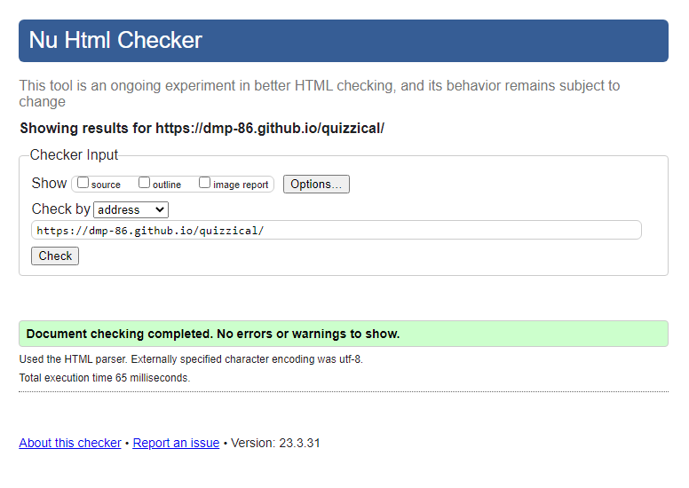
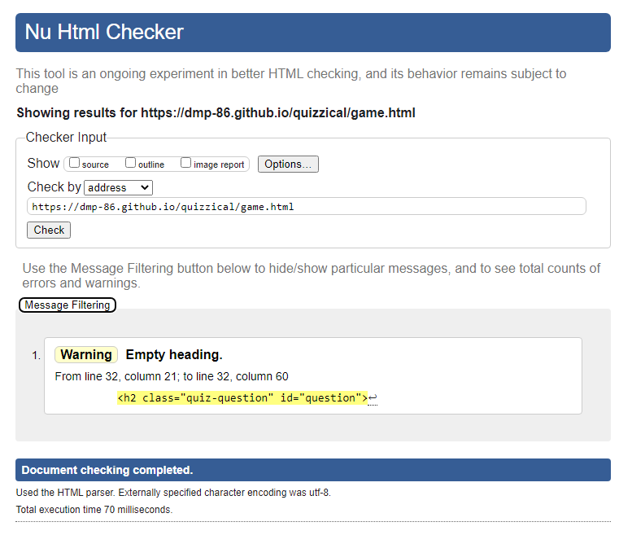
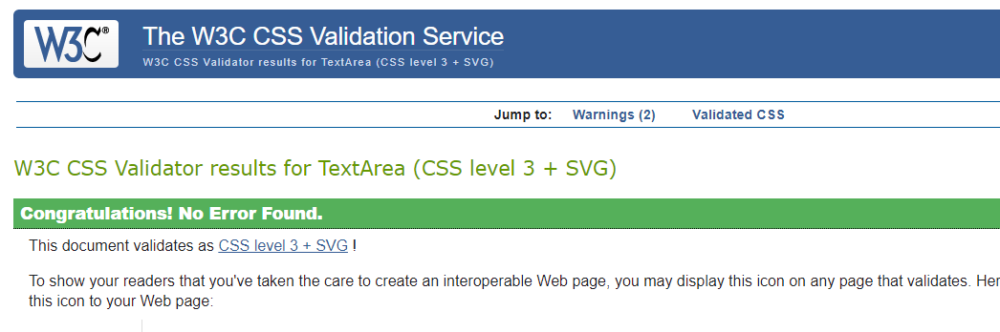
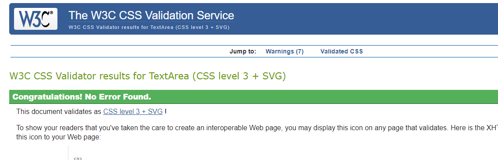
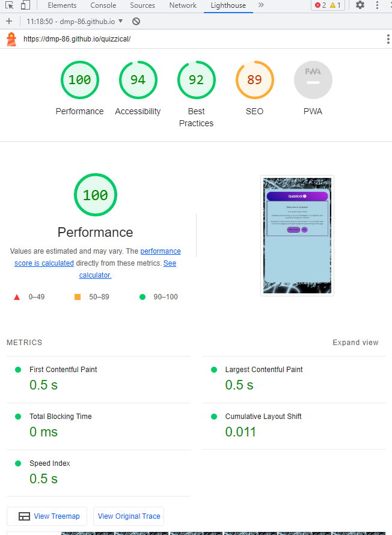
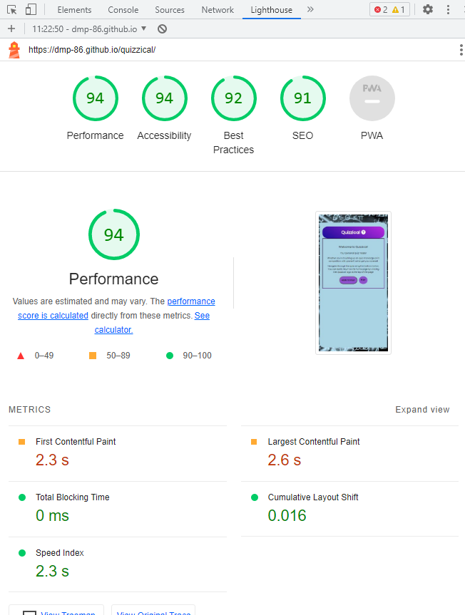
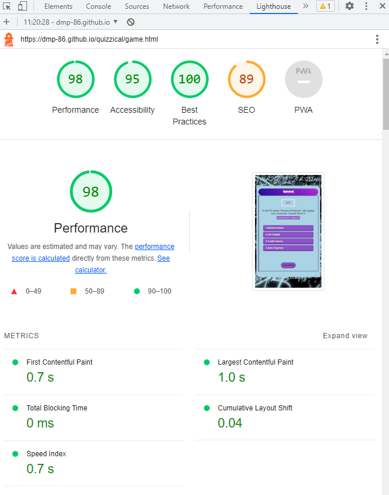
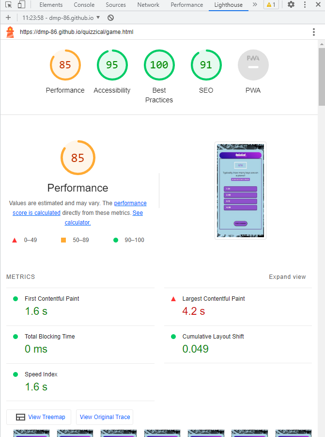

# Testing

Return back to the [README.md](README.md) file.

## Code Validation

### HTML

I have used the recommended [HTML W3C Validator](https://validator.w3.org) to validate all of my HTML files.

| Page | W3C URL | Screenshot | Notes |
| --- | --- | --- | --- |
| Home | [W3C](https://validator.w3.org/nu/?doc=https%3A%2F%2Fdmp-86.github.io%2Fquizzical%2F) |  | Pass: No Errors |
| Game| [W3C](https://validator.w3.org/nu/?doc=https%3A%2F%2Fdmp-86.github.io%2Fquizzical%2Fgame.html) |  | Initial error - Section lacks text in heading. No action necessary as this doesn't effect the game. End result: Pass: No Errors |

### CSS

I have used the recommended [CSS Jigsaw Validator](https://jigsaw.w3.org/css-validator) to validate all of my CSS files.

| File | Jigsaw URL | Screenshot | Notes |
| --- | --- | --- | --- |
| style.css | [Jigsaw](https://jigsaw.w3.org/css-validator/validator?uri=https%3A%2F%2Fdmp-86.github.io%2Fquizzical%2F&profile=css3svg&usermedium=all&warning=1&vextwarning=&lang=en#warnings) |  | Pass: No Errors |
| game.css | [Jigsaw](https://jigsaw.w3.org/css-validator/validator?uri=https%3A%2F%2Fdmp-86.github.io%2Fquizzical%2F&profile=css3svg&usermedium=all&warning=1&vextwarning=&lang=en#warnings) |  | Pass: No Errors |

## Browser Compatibility

I have tested the live deployed site on the following browsers to check for compatibility issues:

- [Chrome](https://www.google.com/chrome)
- [Firefox (Developer Edition)](https://www.mozilla.org/firefox/developer)
- [Edge](https://www.microsoft.com/edge)
- [Safari](https://support.apple.com/downloads/safari)

I've tested my deployed project on multiple browsers to check for compatibility issues.

| Browser | Screenshot | Notes |
| --- | --- | --- |
| Chrome |  | Works as expected |
| Firefox |  | Works as expected  |
| Edge |  | Works as expected |
| Safari |  | Minor CSS differences |

## Lighthouse Audit

I've tested my deployed project using the Lighthouse Audit tool to check for any major issues.
My first test produced some performance issues due to chrome extensions (see screenshot below). To negate further performance issues, I ran Lighthouse Audits in Incognito mode. 

| Page | Size | Screenshot | Notes |
| --- | --- | --- | --- |
| Home | Desktop |  | No issues |
| Home | Mobile |  | No issues |
| Game  | Desktop |  | No issues |
| Game | Mobile |  | A minor warning on performance |

## Bugs

- Favicon error: 

    - To fix this, I created a faviconand added it to my hmtl pages.

[Add A Favicon to A Website in HTML](https://www.youtube.com/watch?app=desktop&v=kEf1xSwX5D8)

## Unfixed Bugs

There are no remaining bugs that I am aware of.
